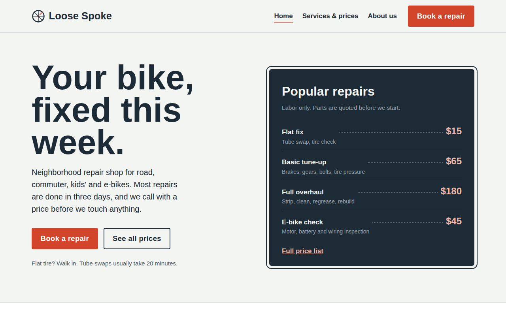

# Loose Spoke Bike Repair

A four-page concept website (all pages in one HTML file) for a neighborhood bike repair shop, built to turn visitors into booked repairs.

## Pages
- **Home** (`#home`): headline, popular prices, how drop-off works, bikes we fix, reviews
- **Services & prices** (`#services`): tune-up comparison table, full repair price list, FAQ
- **About us** (`#about`): shop story, promises, team, address and hours
- **Book a repair** (`#book`): booking form with live price estimate

## Features
- Page switching without reloading; the back button and direct links work
- Mobile menu that opens and closes (also closes with the Escape key)
- "Book" links on the prices page pre-select that service on the booking form
- Booking form validation: blocks past dates and days the shop is closed
- Live labor estimate and a character counter on the booking form
- Today's opening hours highlighted automatically
- Fully responsive and keyboard accessible

## Files
- `index.html`: all four pages; JavaScript shows one at a time
- `style.css`: all styles
- `script.js`: page switching, menu, booking form and hours highlight

## Built with
HTML, CSS, JavaScript. No frameworks.

## Run it
Open `index.html` in any browser.
# repairBike
